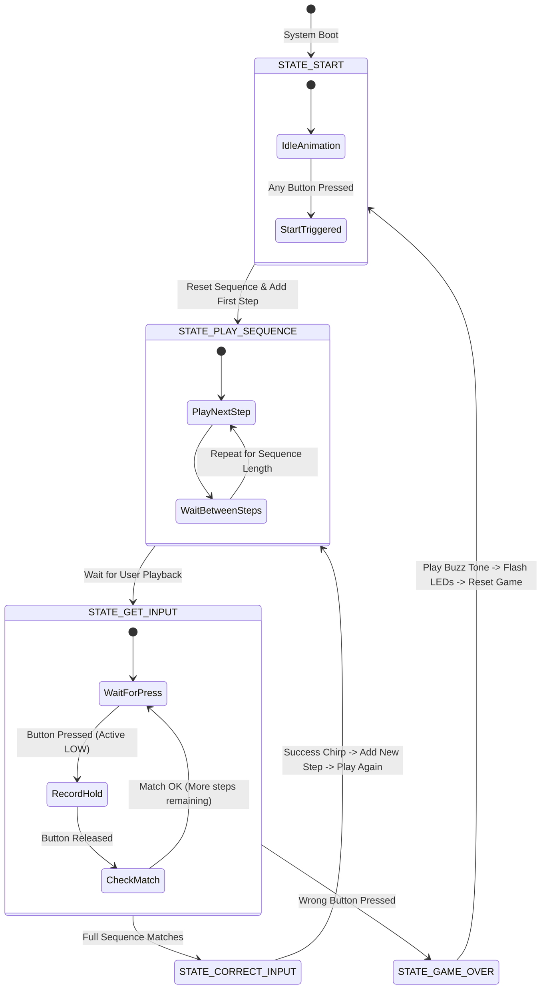

# Build a Simon Says Game on the Feather M4 Express

Welcome! In this guide, you will learn how to build the classic electronic game **"Simon Says"** (or just "Simon"). This project is a great way to understand **state machines**, **non-blocking timing**, **button debouncing**, and **analog audio generation**.

---

## 1. Hardware Connections

We use a square arrangement of **4 buttons** and **4 LEDs**, along with a speaker or piezo buzzer on the true analog output pin `A0` (DAC). 

### Pin Mapping Table
| Game Element | Color | Feather M4 GPIO Pin | Notes |
| :--- | :--- | :--- | :--- |
| **LED 0** | Red | `6` | Driven via PWM / `analogWrite` |
| **LED 1** | Green | `5` | Driven via PWM / `analogWrite` |
| **LED 2** | Blue | `22` | Driven via PWM / `analogWrite` |
| **LED 3** | Yellow | `21` | Driven via PWM / `analogWrite` |
| **Button 0** | (Controls Red) | `12` | Configured as `INPUT_PULLUP` (connects to GND) |
| **Button 1** | (Controls Green) | `13` | Configured as `INPUT_PULLUP` (connects to GND) |
| **Button 2** | (Controls Blue) | `11` | Configured as `INPUT_PULLUP` (connects to GND) |
| **Button 3** | (Controls Yellow) | `10` | Configured as `INPUT_PULLUP` (connects to GND) |
| **Audio Output** | Piezo/Speaker | `A0` | Standard DAC output pin |
| **Ground Pin** | Helper GND | `9` | Programmed to stay `LOW` (GND) to simplify wiring |

---

## 2. Core Concepts

### A. The State Machine
A **State Machine** is a programming model where the code behaves differently depending on its current "state". Instead of doing everything in one giant loop, the microcontroller jumps between defined modes of operation. 

Here is the flow of the game:



---

### B. What is Button Bounce (and why do we Debounce)?
When you press a physical button, the metal contacts inside do not close instantly in a single clean connection. Instead, they bounce together like a dropped rubber ball, making and breaking connection dozens of times in the span of a few milliseconds.

```
Pressing Button ──>  █   █ ███████ (Raw input bounces up and down)
Debounced State ──>  █████████████ (Stable reading after 40ms)
```

Without **debouncing**, the microcontroller is so fast that it will interpret this electrical noise as you pressing the button 5 or 6 times in a row! 

To fix this, our code reads the pin and starts a timer. If the pin keeps the same reading for at least **40 milliseconds**, the software accepts the state change as a real button press or release.

---

### C. DAC Audio (A0)
The Feather M4 features a SAMD51 microcontroller with a built-in **Digital-to-Analog Converter (DAC)** on pin `A0`. We use the standard Arduino `tone(A0, frequency)` function, which generates a clean square wave on this pin to drive a piezo buzzer or small speaker at different pitches.

We mapped the classic "Simon" sounds to these frequencies:
- **Red Button (LED 0):** `310 Hz`
- **Green Button (LED 1):** `252 Hz`
- **Blue Button (LED 2):** `209 Hz`
- **Yellow Button (LED 3):** `415 Hz`
- **Game Over (Fail):** `42 Hz` (low rasping buzz)

---

## 3. Code Walkthrough

Let's dissect how the code in `src/main_simon.cpp` is built:

### 1. Variables and Setup
We define arrays to group our pins and frequencies. This lets us use a simple `for` loop to inspect or set them instead of duplicate code block structures.

```cpp
const int buttonPins[] = {12, 13, 11, 10}; 
const int ledPins[] = {6, 5, 22, 21};       
const int buttonTones[] = {310, 252, 209, 415};
```

In `setup()`, we define the pin behaviors:
```cpp
void setup() {
  pinMode(groundPin, OUTPUT);
  digitalWrite(groundPin, LOW); // Acts as a local GND pin

  for (int i = 0; i < numElements; i++) {
    pinMode(buttonPins[i], INPUT_PULLUP); // Button pin pulls up to 3.3V
    pinMode(ledPins[i], OUTPUT);         // LED outputs
    analogWrite(ledPins[i], 0);          // Start turned off
  }
  pinMode(audioPin, OUTPUT);
}
```

---

### 2. The Debouncing Loop
At the top of the main `loop()`, we update the button states. If the reading of a pin changed, we reset `lastDebounceTime`. Once the reading has been stable for `debounceDelay` (40ms), we update the official `buttonState[i]`.

```cpp
void updateButtons(unsigned long currentMillis) {
  for (int i = 0; i < numElements; i++) {
    bool reading = digitalRead(buttonPins[i]);
    
    if (reading != lastButtonState[i]) {
      lastDebounceTime[i] = currentMillis; // Reset timer
    }
    
    if ((currentMillis - lastDebounceTime[i]) > debounceDelay) {
      buttonState[i] = reading; // Update stable state
    }
    
    lastButtonState[i] = reading;
  }
}
```

---

### 3. Playing back the sequence (Non-Blocking)
Instead of using `delay()` which pauses the chip and stops it from reading buttons, we check `millis()` timers continuously. This ensures our code is responsive.

```cpp
case STATE_PLAY_SEQUENCE: {
  // Get faster as sequence length increases:
  int playbackSpeed = max(150, 400 - (sequenceLength * 15));
  int offDuration = playbackSpeed / 2;

  if (!stepActive) {
    if (currentMillis - stepTimer >= offDuration) {
      int ledIndex = sequence[currentStepIndex];
      activateLedAndTone(ledIndex); // Turn LED on, play tone
      stepActive = true;
      stepTimer = currentMillis;
    }
  } else {
    if (currentMillis - stepTimer >= playbackSpeed) {
      int ledIndex = sequence[currentStepIndex];
      deactivateLedAndTone(ledIndex); // Turn LED off, stop tone
      stepActive = false;
      stepTimer = currentMillis;
      currentStepIndex++;

      if (currentStepIndex >= sequenceLength) {
        playerIndex = 0;
        currentState = STATE_GET_INPUT; // Hand over turn to player
      }
    }
  }
  break;
}
```

---

### 4. Reading Player Input
When we are in `STATE_GET_INPUT`, we check if a button goes `LOW` (pressed):
1. **Button Pressed:** Turn on the corresponding LED and tone. Set `pressedButton` to track which index is active.
2. **Button Released:** Stop LED and tone, then verify if it was the correct button matching `sequence[playerIndex]`.
   - **Correct:** Move to the next step. If all steps match, go to `STATE_CORRECT_INPUT`.
   - **Incorrect:** Instantly jump to `STATE_GAME_OVER`.

```cpp
case STATE_GET_INPUT: {
  static int pressedButton = -1;
  
  if (pressedButton == -1) {
    for (int i = 0; i < numElements; i++) {
      if (buttonState[i] == LOW) { // Button is stably pressed
        pressedButton = i;
        activateLedAndTone(pressedButton);
        break;
      }
    }
  } else {
    if (buttonState[pressedButton] == HIGH) { // Button is stably released
      deactivateLedAndTone(pressedButton);
      
      if (pressedButton == sequence[playerIndex]) {
        playerIndex++;
        pressedButton = -1;
        if (playerIndex >= sequenceLength) {
          currentState = STATE_CORRECT_INPUT;
          stateTimer = currentMillis;
        }
      } else {
        pressedButton = -1;
        currentState = STATE_GAME_OVER;
        stateTimer = currentMillis;
      }
    }
  }
  break;
}
```
