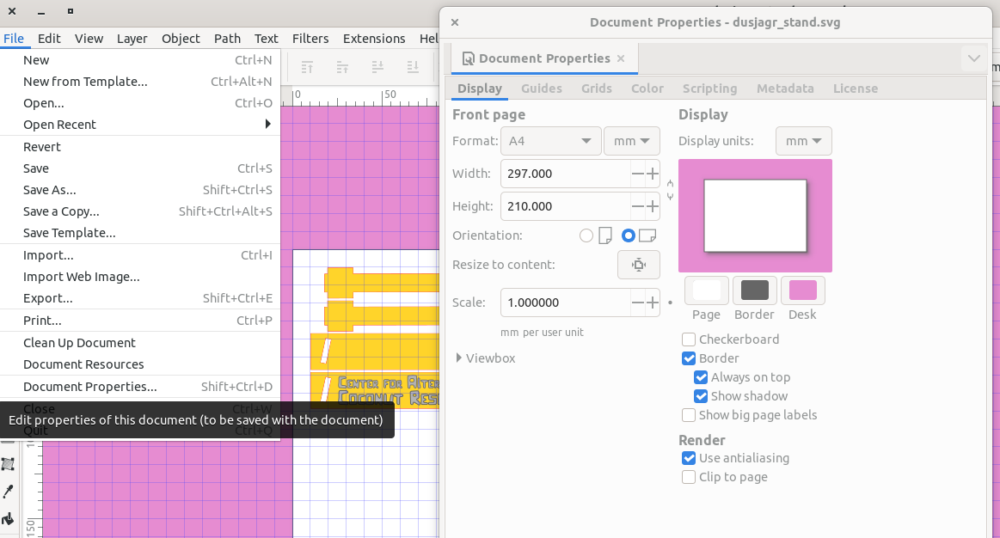
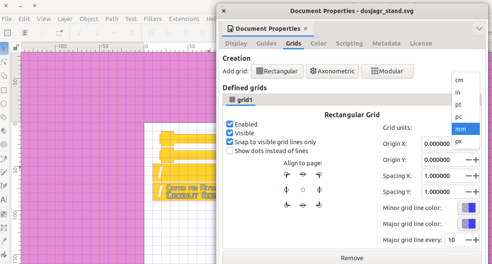
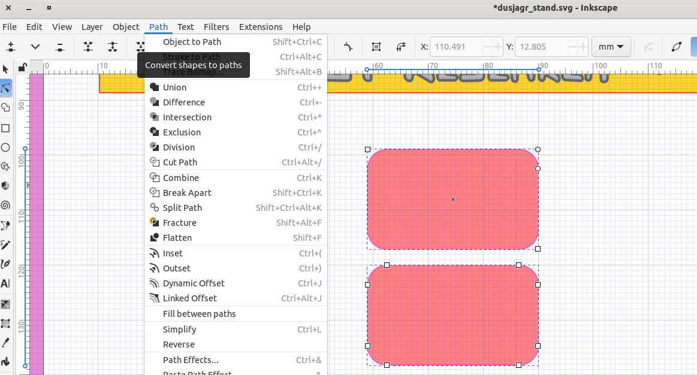
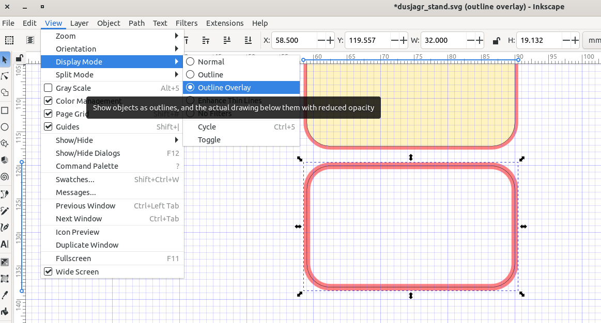

## What is Inkscape?

Inkscape is a professional-quality, free, and open-source vector graphics editor. Unlike raster graphics editors (like Photoshop or GIMP) that store images as a grid of pixels, vector graphics software stores images as mathematical formulas describing shapes, lines, and curves. This means that vector designs can be scaled infinitely without any loss of quality or pixelation, making them the standard format for precise digital fabrication.

In the context of laser cutting, Inkscape is an essential tool. Laser cutters require vector paths to instruct the laser head exactly where to move. Inkscape allows you to create these precise paths, set exact dimensions, combine complex geometries, and define specific colors or stroke widths that the laser cutter software interprets as distinct operations (such as cutting vs. engraving).

## Setting up the document / workspace

### Units

Use millimeters (mm) as the base unit for your design. This is the standard unit for laser cutters and ensures that your design is scaled correctly.

### Page size

The page size should match the size of the material you are using. For example, if you are using an A4 piece of wood or acrylic (297mm x 210mm), then the page size should be 297mm x 210mm. Portrait or landscape does not matter.

### Grid size for technical drawings

Use a grid size of 1mm. This ensures your design is precise and helps align elements accurately, especially when working with dimensions that are multiples of 10mm (as laser-cut slots are typically 10mm wide). You can turn on / off to view the grid by pressing `#` on your keyboard, in View tab.

### Snapping options

Enable the snapping tool to ensure precise alignment of design elements. The snapping options allow you to snap to the grid, to objects, and to other alignment points. The icon for snapping is located in the top right corner of the window, or press `%` on your keyboard.

### Object or Path?

In Inkscape there is a distinction between paths and objects. Paths are vector paths that can be edited, while objects are special like circles, fonts, rectangles with special options. At the end of your design, you need to convert all objects to paths, under "Path" -> "Object to Path" (Strg+Shift+C).

### Display Modes, see the "real" lines / not strokes

More description coming soon...

